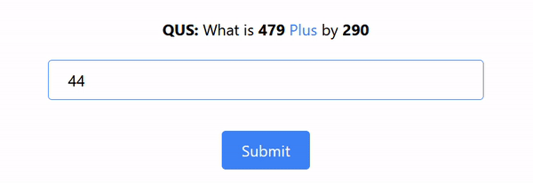
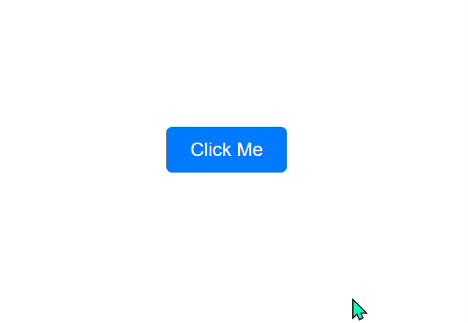

# CSS Simple Animation Snippets

Welcome to **CSS Simple Animation Snippets**! This extension provides a collection of CSS animation snippets that you can quickly insert into your projects. Enhance your web development workflow with easy-to-use, commonly used animations.

## Features

This extension includes the following CSS animations:

### Shake Animation

Use this animation on input elements when there is an error or wherever you like.

- **Prefix**: `.shake`
- **GIF**:
  

### Pop Animation

Apply this 'pop' class name on the HTML element to show the animation.

- **Prefix**: `.pop`
- **GIF**:
  

### Float Animation

Float an element like a balloon.

- **Prefix**: `.float`
- **GIF**:
  

### Spin Animation

Use this animation to spin something, such as a loader.

- **Prefix**: `.spin`
- **GIF**:
  

### Pulse Animation

Creates a pulsing effect, perfect for skeleton loaders or highlighting elements.

- **Prefix**: `.pulse`
- **GIF**:
  

### Wobble Animation

Moves the element back and forth to create a wobbling effect, useful for drawing attention.

- **Prefix**: `.wobble`
- **GIF**:
  

### Fade In Animation

Smoothly transitions the element from invisible to visible. Customize as needed.

- **Prefix**: `.fade-in`

### Slide In from Left Animation

Slides the element in from the left side. Adjust values as necessary.

- **Prefix**: `.slide-in-left`

### Bounce Animation

Bounces the element like a ball, ideal for animated loaders or playful effects.

- **Prefix**: `.bounce`

### Flip Animation

Rotates the element 360 degrees along the Y-axis, ideal for flipping cards or icons.

- **Prefix**: `.flip`

## Requirements

No special requirements or dependencies.

## Extension Settings

This extension does not add any VS Code settings.

## Known Issues

No known issues at the moment.

## Release Notes

### 1.0.0

Initial release of CSS Simple Animation Snippets.

---

## Working with Markdown

You can author your README using Visual Studio Code. Here are some useful editor keyboard shortcuts:

- Split the editor (`Cmd+\` on macOS or `Ctrl+\` on Windows and Linux).
- Toggle preview (`Shift+Cmd+V` on macOS or `Shift+Ctrl+V` on Windows and Linux).
- Press `Ctrl+Space` (Windows, Linux, macOS) to see a list of Markdown snippets.

## For more information

- [Visual Studio Code's Markdown Support](http://code.visualstudio.com/docs/languages/markdown)
- [Markdown Syntax Reference](https://help.github.com/articles/markdown-basics/)

**Enjoy!**
